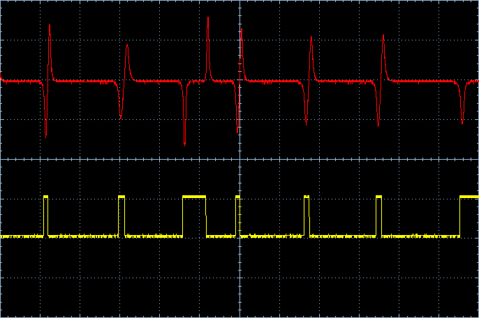
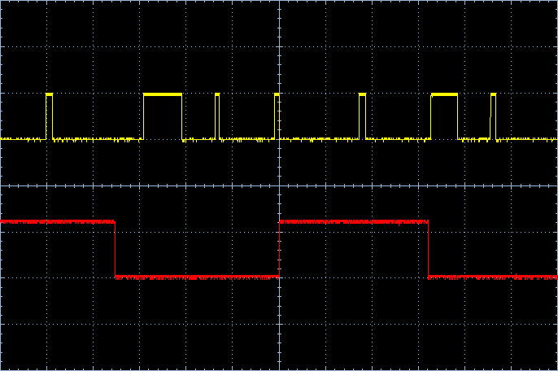
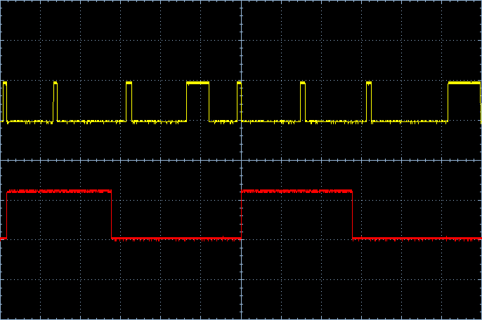
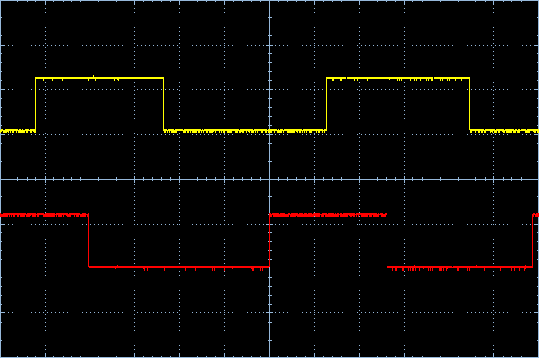
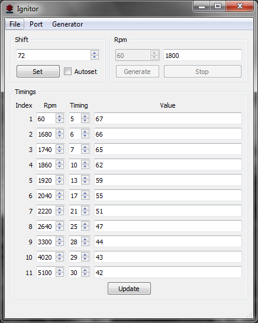

# Motorcycle Ignition Controller

A reverse-engineering project.  
The point is to create an electronic ignition module for a motorcycle that has long been out of production.

## Overview
Ignition module is for Suzuki VS400 motorcycle 1995 year of production. The motorcycle was made for internal japanese market only.  
Original module just suddenly burned away with no evidence of any damage, possibly due to some electrical impulse.  
No visible damage was detected, but the main MCU of the module just died.  
Proposed replacement alternatives were not suitable in any way, because of slightly different schematics.  
As a result, I've decided to repair this ignition module using some available spare parts.  

## Repository Contents
* **board/** - Schematics with a new MCU for replacement
* **firmware/** - Firmware for the new MCU
* **doc/** - General project documentation files
* **package/** - Binary and settings
* **service/** - A desktop application program for module configuration

## Principles of Work
The ignition principle based on the rotor sensor is well described [here](https://www.denso-am.eu/products/engine-management-systems/camshaft-crankshaft-sensors).  
In my case, the rotor has only 4 teeth, and one of them is longer than the others.  
This is how the raw and the filtered sensor signal looks like.  
  
At first I discovered the accurate positions where the coils need to be ignited.  
The front cylinder coil.  
  
The rear cylinder coil.  
  
Thus both cylinder coils are ignited one by one.  
  
As you can see the distance between ignition point corresponds to the position of the shaft.  
The motorcycle has a V-twin engine with 45 degrees angle between cylinders.

## Schematics
I couldn't find schematics for this specific motorcycle. The way that ignition module in connected to coils and sensors is a little bit different than similar models.  
It has one line for rotor sensor and one dedicated line for neutral sensor.  
In the `board` folder you can find schematics file made with [Eagle CAD 7.6.0](http://eagle.autodesk.com/eagle/software-versions/2) program.  
The schematics shows how a replacement MCU is connected to the original board.  
You can also take a look at the schematics in `doc/ignitor.pdf` file.  

## Software

### Firmware
To build the firmware you need avr-gcc toolchain installed. I used [WinAVR](https://winavr.sourceforge.net/) when building in Windows.  
In the `firmware` folder simply run `make` in shell. The binary is `firmware/build/ignitor.hex` file.  
To load the firmware you need an ISP programmer and an [avrdude](https://www.nongnu.org/avrdude/) utility. I used simple USP ISP programmator.  
Then run `make prog` to load the firmware.

### Desktop Application
The application is written in C++ and is based on Qt5 framework.    
Used [Qt 5.9.2](https://download.qt.io/archive/qt/5.9/5.9.2/) with MinGW toolchain.  
The service application requires [LTR libraries](https://www.lcard.ru/download/ltrdll.exe) to be installed in the system.  
[LTR35](https://www.lcard.ru/products/ltr/ltr35) module was used as an imitator of the sensor signal for development purposes.  
But the generator itself is not needed for ignition testing and configuration.  
  
Open `service/ignitor.pro` file in Qt Creator and build the project the usual way.
